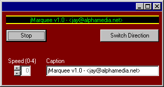



## jMarquee Control

### Description

This control handle Many Customization Factors, including Caption, ForeColor, InsideTrackColor, OutsideTrackColor, Direction, Speed and More! jMarquee is set up now to handle one line of streaming text, but is Multi-Line Ready. This could be useful for scrolling Stocks etc.. with multiple lines moving at multiple varying speeds.
 
### More Info
 

             |
---                |---
**Submitted On**   |2000-08-16 10:33:56
**By**             |[Sparq](https://github.com/Planet-Source-Code/PSCIndex/blob/master/ByAuthor/sparq.md)
**Level**          |Intermediate
**User Rating**    |4.3 (13 globes from 3 users)
**Compatibility**  |VB 6\.0
**Category**       |[Custom Controls/ Forms/  Menus](https://github.com/Planet-Source-Code/PSCIndex/blob/master/ByCategory/custom-controls-forms-menus__1-4.md)
**World**          |[Visual Basic](https://github.com/Planet-Source-Code/PSCIndex/blob/master/ByWorld/visual-basic.md)
**Archive File**   |[CODE\_UPLOAD90058162000\.zip](https://github.com/Planet-Source-Code/sparq-jmarquee-control__1-10727/archive/master.zip)

